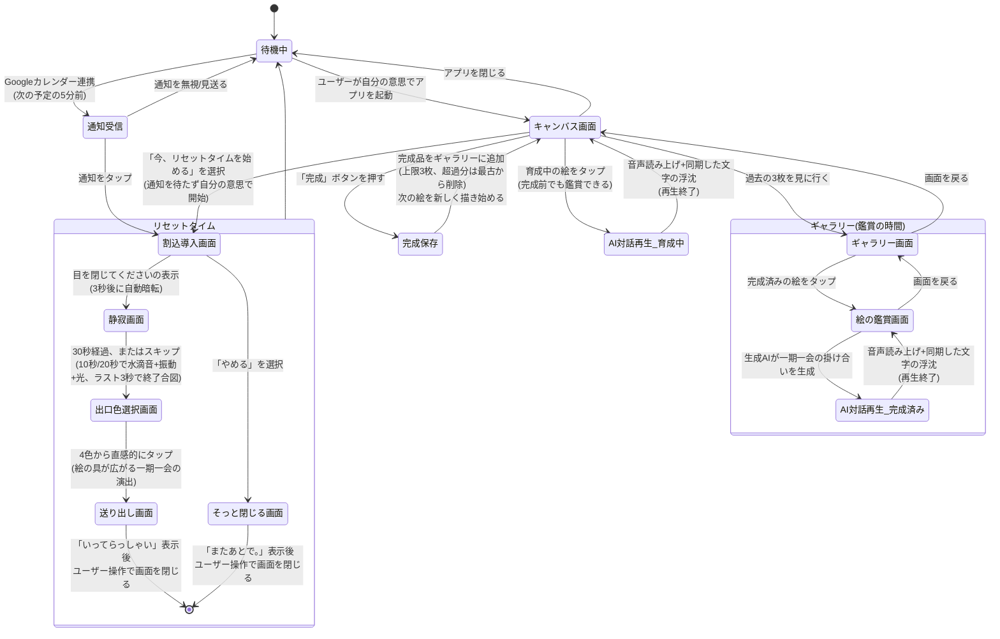

# スローテックアプリ 画面遷移図

仕様書([仕様書.md](./仕様書.md))を基にした画面・状態の遷移。

## 状態の補足

| 状態 | 説明 | 対応する仕様書の節 |
|---|---|---|
| 待機中 | 通知待ち、または他アプリ使用中の状態 | - |
| 通知受信 | カレンダー連携によりトリガーされた通知が届いている状態 | 時間①フェーズ1 |
| 割込導入画面 | 「Slow」に意識を向ける問いが表示される画面。常時「やめる」の小さな導線を表示 | 時間①フェーズ1 |
| 静寂画面 | 目を閉じて過ごす30秒間の体験。常時「やめる」の小さな導線を表示し、十分落ち着けたらスキップして出口色選択画面へ進める | 時間①フェーズ2 |
| 出口色選択画面 | 4色から今の気分に近い色を選ぶ画面 | 時間①出口 |
| 送り出し画面 | 選んだ色が広がり「いってらっしゃい」で終わる画面 | 時間①出口 |
| そっと閉じる画面 | 割込導入画面で「やめる」を選んだ場合の送り出し。「またあとで。」のような一言を表示 | 時間①フェーズ1 |
| キャンバス画面 | アプリを開くと最初に表示される、現在の絵を見せる画面。「リセットタイムを始める」「過去の3枚を見に行く」の導線を置く | 入口：キャンバス画面 |
| ギャラリー画面 | 完成済み3枚が並ぶ空間 | 時間②画面の見た目 |
| 完成保存 | 「完成」ボタンで絵を確定させる操作 | 時間②画面の見た目 |
| 絵の鑑賞画面 | 完成済みの絵を選んでAI対話を見る画面 | 時間②複数AIによる鑑賞 |
| AI対話再生_育成中 | キャンバス画面の育成中の絵に対する、生成AIによる一期一会の掛け合いの再生 | 時間②複数AIによる鑑賞 |
| AI対話再生_完成済み | ギャラリーの完成済みの絵に対する、生成AIによる一期一会の掛け合いの再生 | 時間②複数AIによる鑑賞 |
